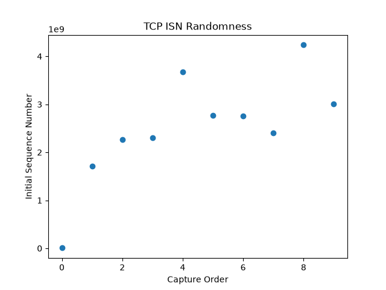
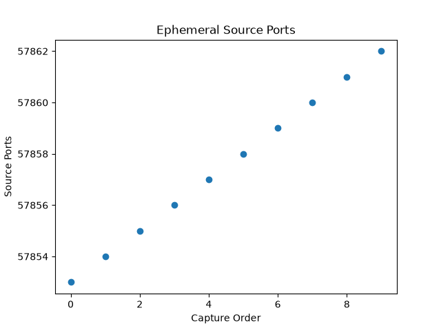

# TCP Spoofing Resistance Demo

A simple TCP echo server and client, plus a script that captures and visualizes TCP Initial Sequence Numbers (ISNs) and source ports, to demonstrate two of the mechanisms that make blind TCP spoofing difficult.

## Why I built this

I wanted to actually understand TCP mechanics (seq/ack numbers, sliding window, handshake) by building something with it, instead of just reading about it. Then I extended it into a small security demo, demonstrating why blind TCP spoofing attacks, like the 1994 Mitnick-Shimomura attack, do not work against modern systems.

## What's in here

- `server.py`, TCP echo server (bind, listen, accept, recv, send, close, in a loop)
- `client.py`, TCP client that connects, sends a message, receives the echo
- `sniff.py`, captures live SYN packets with scapy, extracts the ISN and source port from each, and plots both with matplotlib

## Questions I asked myself while building this

1. Initially I learned that I had to create two sockets but I was not sure why. Why create a new socket every new incoming connection that we accept(). ?

I learned that the listening socket, s, just watches the door for new connections. Every accept() call creates a brand new, separate socket for that one client.

2. Why is the original socket different from the rest? I was curious to know why a socket opened with Python at first is actually not the one that accepts connections.

The listening socket only manages the connection queue and never exchanges application data. accept() takes a completed connection from the queue and gives it its own dedicated socket with its own TCB, so each client's data stays independently tracked even while sharing the same listening port.

3. What RFCs are relevant to my findings about ISN randomness?

RFC 6528, Defending against Sequence Number Attacks, on ISN randomization

## The ISN randomness result

I captured 10 SYN packets across separate connections. The ISNs were scattered across the full range with no incrementing pattern or fixed delta (change) between them, consistent with proper OS level ISN randomization.

## The source port result

I also captured the source port for the same 10 connections. Unlike the ISNs, the source ports came out linear, incrementing by 1 with each new connection. This was an interesting finding because although it's hard to guess the first source port opened, the rest were linear and predictable. It is an accurate reflection of how an OS allocates ephemeral ports, and it is exactly the weakness RFC 6056 was written to address.

## Why this matters

This project demonstrates two of the independent defenses against blind TCP spoofing, described in the following RFCs.

RFC 6056, Recommendations for Transport-Protocol Port Randomization, on source port randomization:
"These attacks rely on the attacker's ability to guess or know the five-tuple (Protocol, Source Address, Destination Address, Source Port, Destination Port) that identifies the transport protocol instance to be attacked. This document describes a number of simple and efficient methods for the selection of the client port number, such that the possibility of an attacker guessing the exact value is reduced."
https://www.rfc-editor.org/rfc/rfc6056.html

RFC 6528, Defending against Sequence Number Attacks, on ISN randomization:
"This document specifies an algorithm for the generation of TCP Initial Sequence Numbers (ISNs), such that the chances of an off-path attacker guessing the sequence numbers in use by a target connection are reduced."
https://datatracker.ietf.org/doc/html/rfc6528

## Limitations

This server handles one client at a time, sequentially, not concurrently. A production server would need threading or async to handle multiple simultaneous clients.
